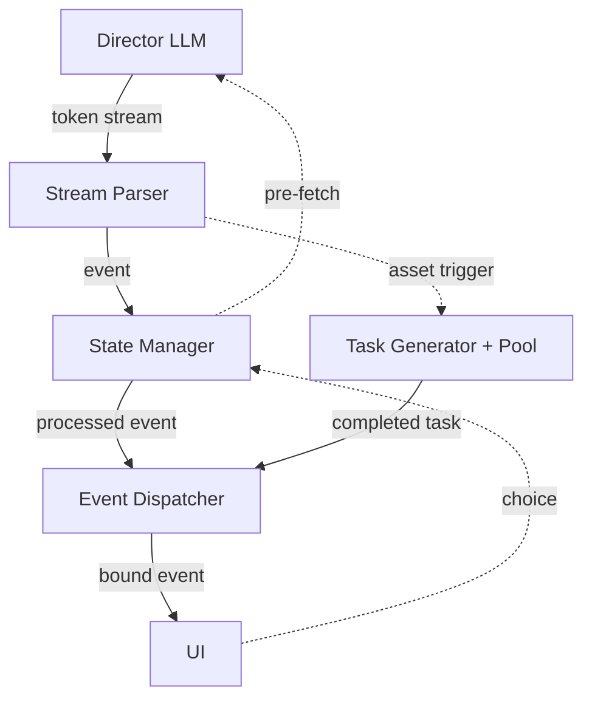

<p align="center">
  
</p>

# Storyloom

> AI 驱动的实时视觉小说引擎。

[English](./README.md) | [简体中文](./README-zh-CN.md)

[](https://www.python.org/)
[](./LICENSE)
[](https://github.com/SiriLee/Storyloom/actions)

<!-- TODO: screenshot or GIF demo -->

---

## 安装

### 独立二进制

*无需安装 Python。*

从 [Releases](https://github.com/SiriLee/Storyloom/releases/latest) 下载
`storyloom-v{VERSION}-{platform}.zip`，解压后运行 `Storyloom` 即可。

### 通过 PyPI 安装

*需要 Python ≥ 3.10。*

```bash
pip install storyloom-engine
```

可选附加组件：

```bash
pip install "storyloom-engine[desktop,bg]"   # 原生窗口 + 背景移除
```

| 附加组件 | 作用 |
|---------|------|
| `desktop` | 通过 `pywebview` 提供原生桌面窗口 —— 不可用时自动回退到浏览器 |
| `bg` | 生成图像的背景移除（`onnxruntime`；模型已内置） |

系统媒体素材不包含在 wheel 中。首次启动时通过 **设置 → 更新** 下载。

### 从源码安装

```bash
git clone https://github.com/SiriLee/Storyloom.git
cd Storyloom
pip install -e ".[desktop,bg]"
```

### 数据目录与卸载

用户数据 —— `config.json`、`saves/`、`media/`、`system_media/` —— 存放在安装包之外：

| 安装方式 | 数据目录 |
|---------|---------|
| 独立二进制 | `Storyloom` 可执行文件所在目录 |
| wheel（pip） | `~/.local/share/Storyloom`（Linux）、`~/Library/Application Support/Storyloom`（macOS）、`%APPDATA%\Storyloom`（Windows） |
| 从源码安装 | 仓库根目录 |

可通过 `STORYLOOM_APP_DIR` 环境变量覆盖。

`pip uninstall storyloom-engine` 只会卸载软件包，**不会**删除你的数据。
存档与媒体文件会被保留。如需彻底删除：

```bash
pip uninstall storyloom-engine
rm -rf ~/.local/share/Storyloom   # 按上表调整路径
```

### 网络与代理

更新从 GitHub Releases 拉取。在防火墙后或 GitHub 受限的地区，请在
**设置 → 系统 → 网络代理**（HTTP/SOCKS5）中配置代理。

---

## 使用

```bash
storyloom-web                 # 原生桌面窗口（或回退到浏览器）
storyloom-web --browser       # 始终在浏览器中打开
storyloom-web --port 8080     # 自定义端口（默认：自动分配）
storyloom-web --help          # 查看全部选项

# 或者
python -m storyloom.web
```

首次启动会打开设置页。输入 API 密钥，选择模式（**文本**或**图形**），
然后开始新游戏。

> **系统媒体素材**（约 267 MB 的角色立绘与背景图片）已包含在独立发布版的
> 压缩包中。通过 wheel 或源码安装的用户，可在应用内通过 **设置 → 更新** 下载。

---

## 功能特性

| | |
|---|---|
| 流式 XML 管线 | `StreamParser → StateManager → EventDispatcher` —— 逐行解析，无需缓冲 |
| 桥接预取 | 下一轮 API 调用在段末提前发起，延迟隐藏在阅读时间之内 |
| 状态校验 | LLM 只*建议*写入；引擎先做类型检查再应用；被拒绝的写入会反馈给 LLM |
| 双层分支 | 场景内选项 + 检查点处的纲要级路线分叉 |
| 素材管线 | O(1) 目录匹配 → LLM 兜底 → AI 生成；异步、非阻塞 |
| 上下文管理 | 滑动窗口 + 第一轮锚点 + 检查点压缩；约 5 万 token |
| 共创 | AI 先就你的创意进行访谈，再生成世界、角色与剧情 |
| 存档 / 读档 | 原子 JSON 存档；与模式无关 —— 可随时在文本 / 图形之间切换 |
| i18n | 英语、简体中文、繁体中文（gettext） |
| Web 界面 | FastAPI + SSE + 原生 JS SPA |
| CLI | 带调试观察器的终端客户端 |
| 打包 | 独立二进制（PyInstaller）+ pip wheel + 系统素材包 |

---

## 架构



实线为流式数据流，虚线为一次性触发。图形模式的素材标签会派生出任务，
以异步方式解析，不会阻塞文本管线。

---

## 文档

| | |
|---|---|
| 理论 | [第一性原理](docs/theory/first-principles.md) · [桥接机制](docs/theory/bridge-mechanism.md) · [流式解析](docs/theory/streaming-parse.md) · [素材生成](docs/theory/asset-generation.md) |
| 规范 | [第一阶段管线](docs/spec/exec-flow.md) · [XML 元素](docs/spec/block-spec.md) · [提示词](docs/spec/prompt-design.md) · [数据模型](docs/spec/data-model.md) |
| 图形模式 | [设计](docs/graph-mode-spec/design.md) |
| API | [GameSession](docs/api/session.md) · [共创](docs/api/co-create.md) |
| 日志 | [工程日志](docs/engineering-journal.md) |

---

## 开发

```bash
# 克隆并安装（`test` 附加组件会引入 pytest 与 babel，用于测试套件）
git clone https://github.com/SiriLee/Storyloom.git
cd Storyloom
pip install -e ".[desktop,bg,test]"

# 测试（无需 API 密钥）
pytest

# 构建
bash scripts/build.sh                # 独立二进制 + wheel
bash scripts/pack_system_media.sh    # 发布用的系统素材包

# 从源定义生成系统素材（需要图像 API 密钥）
python scripts/sysgen/generate_system_assets.py
python scripts/sysgen/generate_manifest.py
```

**约定：** Python ≥ 3.10 · 标准库优先 · Conventional Commits ·
代码与文档使用英文 · mock 测试（不调用真实 API）。

**AI 上下文：** [`AGENTS.md`](AGENTS.md) 是编码代理上下文的唯一权威来源
（Claude Code、Cursor、Windsurf、Copilot、Gemini CLI 等）。
[`CLAUDE.md`](CLAUDE.md) 与
[`.github/copilot-instructions.md`](.github/copilot-instructions.md) 是轻量
兼容桥 —— 共享知识只放在 `AGENTS.md` 中。

---

[MIT](./LICENSE)
