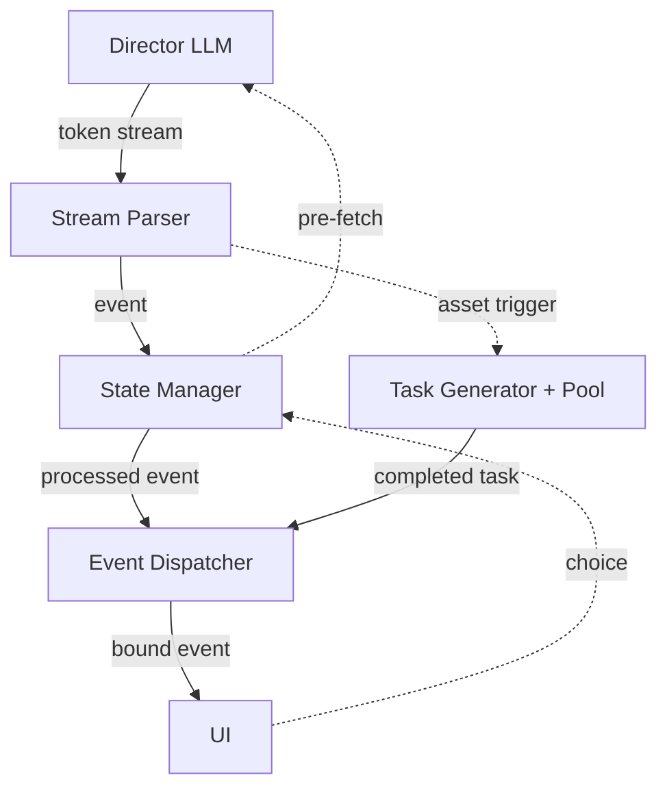

# Storyloom

> An LLM-powered interactive fiction engine with a visual novel mode.

[](https://www.python.org/)
[](./LICENSE)
[](https://github.com/SiriLee/Storyloom/actions)

<!-- TODO: screenshot or GIF demo -->

---

## Install

Download the latest binary for your platform from
[Releases](https://github.com/SiriLee/Storyloom/releases).  No Python required.

Or install from source:

```bash
git clone https://github.com/SiriLee/Storyloom.git && cd Storyloom
pip install -e ".[bg]"
```

`[bg]` adds background removal (`onnxruntime` + a one-time ~4.4 MB model
download during install).  Omit it if you don't need the feature.  The download
is non-fatal — install succeeds either way.

Graph mode needs a one-time asset download into your working directory:

```bash
python3 -c "import urllib.request as u,zipfile as z;u.urlretrieve('https://github.com/SiriLee/Storyloom/releases/download/v2.0.0/system_media-v1.0.0.zip','_sm.zip');z.ZipFile('_sm.zip').extractall('system_media');print('OK')" && rm _sm.zip
```

---

## Configure

```bash
cp config.example.json config.json
```

```json
{
  "api_key": "sk-...",
  "api_base_url": "https://api.deepseek.com",
  "api_model": "deepseek-v4-pro",
  "game_mode": "graph"
}
```

Any OpenAI-compatible provider works. Image generation (graph mode) needs an
additional `img_api_*` block — configure it in the Settings UI on first launch.

---

## Run

```bash
storyloom-web          # → http://127.0.0.1:8000
# or
python -m storyloom.web
```

---

## What It Does

You describe a story idea. The AI interviews you, builds a world, and becomes
your game master. You play through branching narrative — choices matter, state
persists, and the engine handles pacing so you never see a loading spinner.

**Graph mode** adds character portraits and scene backgrounds, declared on the
fly by the AI and resolved by the engine's asset pipeline in real time.

---

## Capabilities

| | |
|---|---|
| Streaming XML pipeline | `StreamParser → StateManager → EventDispatcher` — parsed line-by-line, no buffering |
| Bridge pre-fetch | Next API call fires mid-paragraph; latency hidden behind reading time |
| State validation | LLM *suggests* writes; engine type-checks before applying; rejected writes feed back |
| Two-layer branching | In-scene choices + outline-level route forks at checkpoints |
| Asset pipeline | O(1) catalog match → LLM fallback → AI generation; async, non-blocking |
| Context management | Sliding window + Round 1 anchor + checkpoint compression; ~50K tokens |
| Co-creation | AI interviews you about your idea before generating world, characters, and plot |
| Save / load | Atomic JSON saves; mode-agnostic — switch text/graph any time |
| i18n | English, 简体中文, 繁體中文 (gettext) |
| Web UI | FastAPI + SSE + vanilla JS SPA |
| CLI | Terminal client with debug observer |
| Packaged | `pip install` + standalone binary (PyInstaller) + system asset zip |

---

## Architecture



Solid lines are streaming data flow. Dotted lines are one-shot triggers.
Graph-mode asset tags spawn tasks that resolve asynchronously, without blocking
the text pipeline.

---

## Documentation

| | |
|---|---|
| Theory | [First principles](docs/theory/first-principles.md) · [Bridge mechanism](docs/theory/bridge-mechanism.md) · [Streaming parse](docs/theory/streaming-parse.md) · [Asset generation](docs/theory/asset-generation.md) |
| Spec | [Phase 1 pipeline](docs/spec/exec-flow.md) · [XML elements](docs/spec/block-spec.md) · [Prompts](docs/spec/prompt-design.md) · [Data model](docs/spec/data-model.md) |
| Graph mode | [Design](docs/graph-mode-spec/design.md) |
| API | [GameSession](docs/api/session.md) · [Co-create](docs/api/co-create.md) |
| Log | [Engineering journal](docs/engineering-journal.md) |

---

## Develop

```bash
git clone https://github.com/SiriLee/Storyloom.git && cd Storyloom
pip install -e ".[bg]"

pytest                          # no API key needed

# Build
bash scripts/build.sh           # standalone binary + wheel
bash scripts/pack_system_media.sh  # system asset zip for release
```

```bash
# Generate system assets from source (needs image API key)
python scripts/generate_system_assets.py
python scripts/generate_single_asset.py sys_student_female --dry-run
```

**Conventions:** Python ≥ 3.10 · stdlib-first · Conventional Commits · English
code & docs · mock tests (no real API calls) · Chinese internal discussions.

---

MIT
