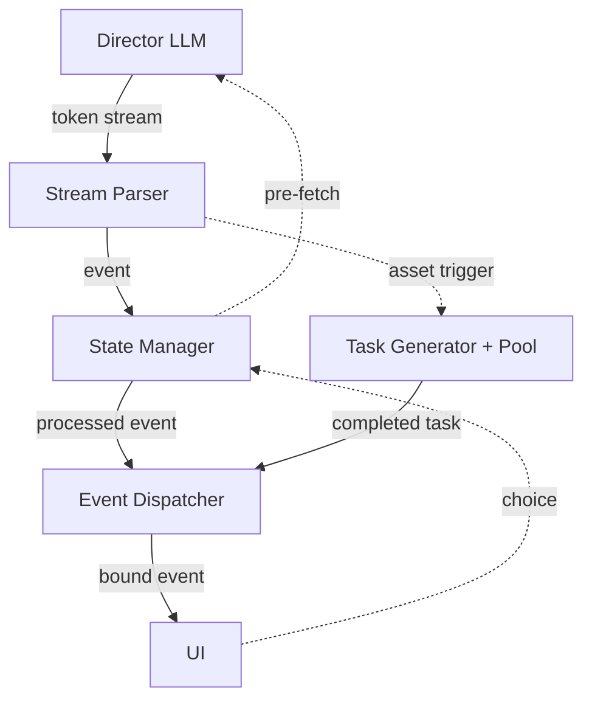

<p align="center">
  
</p>

# Storyloom

> An AI-powered real-time visual novel engine.

[English](./README.md) | [简体中文](./README-zh-CN.md)

[](https://www.python.org/)
[](./LICENSE)
[](https://github.com/SiriLee/Storyloom/actions)

<!-- TODO: screenshot or GIF demo -->

---

## Installation

### Standalone binary

*No Python required.*

Download `storyloom-v{VERSION}-{platform}.zip` from
[Releases](https://github.com/SiriLee/Storyloom/releases/latest), extract,
and run `Storyloom`.

### From PyPI

*Requires Python ≥ 3.10.*

```bash
pip install storyloom-engine
```

Optional extras:

```bash
pip install "storyloom-engine[desktop,bg]"   # native window + background removal
```

| Extra | Adds |
|-------|------|
| `desktop` | Native desktop window via `pywebview` — falls back to browser if unavailable |
| `bg` | Background removal for generated images (`onnxruntime`; model already bundled) |

System media assets are not included in the wheel.  Download them via
**Settings → Updates** on first launch.

### From source

```bash
git clone https://github.com/SiriLee/Storyloom.git
cd Storyloom
pip install -e ".[desktop,bg]"
```

### Data directory & uninstall

User data — `config.json`, `saves/`, `media/`, `system_media/` — lives
outside the installed package:

| Install | Data directory |
|---------|----------------|
| Standalone binary | Next to the `Storyloom` executable |
| Wheel (pip) | `~/.local/share/Storyloom` (Linux), `~/Library/Application Support/Storyloom` (macOS), `%APPDATA%\Storyloom` (Windows) |
| From source | The repository root |

Override with the `STORYLOOM_APP_DIR` environment variable.

`pip uninstall storyloom-engine` removes only the package — **not** your data.
Saves and media are kept.  To remove everything:

```bash
pip uninstall storyloom-engine
rm -rf ~/.local/share/Storyloom   # adjust path per the table above
```

### Network & proxy

Updates are fetched from GitHub Releases. Behind a firewall or in
regions where GitHub is restricted, set a proxy in **Settings → System →
Network Proxy** (HTTP/SOCKS5).

---

## Usage

```bash
storyloom-web                 # native desktop window (or browser fallback)
storyloom-web --browser       # always open in browser
storyloom-web --port 8080     # custom port (default: auto-assign)
storyloom-web --help          # show all options

# or
python -m storyloom.web
```

First launch opens the Settings page.  Enter your API key, select a mode
(**Text** or **Graph**), and start a new game.

> **System media assets** (~267 MB of character portraits and background
> images) are included in the standalone release zip alongside the binary.
> Wheel and source users can download them via **Settings → Updates**
> inside the app.

---

## Features

| | |
|---|---|
| Streaming XML pipeline | `StreamParser → StateManager → EventDispatcher` — parsed line-by-line, no buffering |
| Bridge pre-fetch | Next API call fires mid-paragraph; latency hidden behind reading time |
| State validation | LLM *suggests* writes; engine type-checks before applying; rejected writes feed back |
| Two-layer branching | In-scene choices + outline-level route forks at checkpoints |
| Asset pipeline | O(1) catalog match → LLM fallback → AI generation; async, non-blocking |
| Context management | Sliding window + Round 1 anchor + checkpoint compression; ~50K tokens |
| Co-creation | AI interviews you about your idea before generating world, characters, and plot |
| Save / load | Atomic JSON saves; mode-agnostic — switch text/graph any time |
| i18n | English, 简体中文, 繁體中文 (gettext) |
| Web UI | FastAPI + SSE + vanilla JS SPA |
| CLI | Terminal client with debug observer |
| Packaging | Standalone binary (PyInstaller) + pip wheel + system asset pack |

---

## Architecture



Solid lines are streaming data flow.  Dotted lines are one-shot triggers.
Graph-mode asset tags spawn tasks that resolve asynchronously, without
blocking the text pipeline.

---

## Documentation

| | |
|---|---|
| Theory | [First principles](docs/theory/first-principles.md) · [Bridge mechanism](docs/theory/bridge-mechanism.md) · [Streaming parse](docs/theory/streaming-parse.md) · [Asset generation](docs/theory/asset-generation.md) |
| Spec | [Phase 1 pipeline](docs/spec/exec-flow.md) · [XML elements](docs/spec/block-spec.md) · [Prompts](docs/spec/prompt-design.md) · [Data model](docs/spec/data-model.md) |
| Graph mode | [Design](docs/graph-mode-spec/design.md) |
| API | [GameSession](docs/api/session.md) · [Co-create](docs/api/co-create.md) |
| Log | [Engineering journal](docs/engineering-journal.md) |

---

## Development

```bash
# Clone and install (the `test` extra adds pytest + babel for the test suite)
git clone https://github.com/SiriLee/Storyloom.git
cd Storyloom
pip install -e ".[desktop,bg,test]"

# Tests (no API key needed)
pytest

# Build
bash scripts/build.sh                # standalone binary + wheel
bash scripts/pack_system_media.sh    # system asset pack for release

# Generate system assets from source definitions (requires image API key)
python scripts/sysgen/generate_system_assets.py
python scripts/sysgen/generate_manifest.py
```

**Conventions:** Python ≥ 3.10 · stdlib-first · Conventional Commits ·
English code & docs · mock tests (no real API calls).

**AI context:** [`AGENTS.md`](AGENTS.md) is the single source of truth for
coding-agent context (Claude Code, Cursor, Windsurf, Copilot, Gemini CLI, …).
[`CLAUDE.md`](CLAUDE.md) and
[`.github/copilot-instructions.md`](.github/copilot-instructions.md) are thin
compatibility bridges — keep shared knowledge in `AGENTS.md` only.

---

[MIT](./LICENSE)
