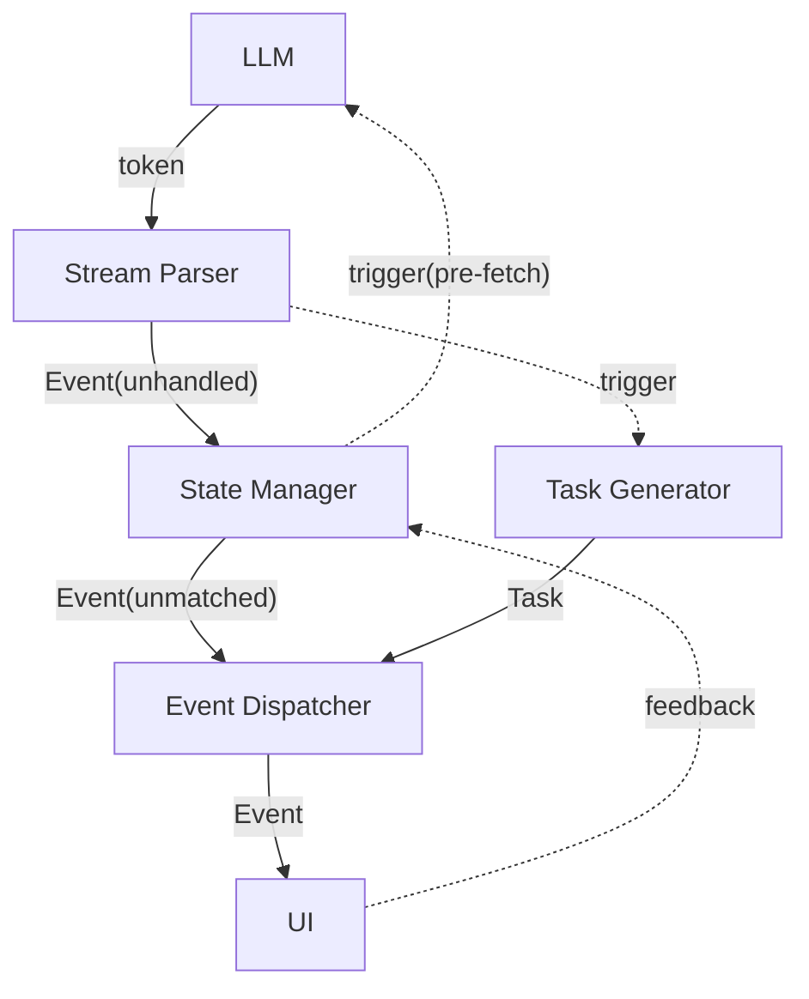

# Phase 2: 图像模式

本文为设计草稿，文档中的所有内容：命名、设计等均未确定，可能修改。本文档确认没有问题后才开始写正式设计文档。

## 目标

- 静态角色立绘 + 静态背景图片
- 为保持可拓展性：程序设计兼容任意类型的“素材”（特效、角色语音等），本文主要以上述两类图像数据为例
- 图像模式与文本模式进行分离，两模式复用核心管线（ Prompt 不同）
- 展示模式为传统视觉小说游戏模式（Galgame、《明日方舟》等）

## 核心数据

### 三层抽象

以背景图片为例：

| 层 | 名称 | 含义 | 使用 |
| --- | --- | --- | --- |
| 故事设定 | locations | 抽象地点 | "locations": [{xxx}, {xxx}] |
| 导演调度 | SCENE | 具体布景 | <declare kind=xxx, ...> |
| 素材存储 | BACKGROUND | 素材类型 | 引擎内部映射 |

示例：
"学校" -> "学校"&"学校.教室" -> "学校.教室"背景图片&背景音乐

### 素材数据库

**素材**

作用：基本素材类，存储路径：`media/asset_type/id.default_extension`

```python
class AssetType(Enum):
    CHAR_PORTRAIT = "char_portrait"
    BACKGROUND = "background_img"
    @property
    def default_extension(self)

class Asset:
    asset_type: AssetType
    id: str # 唯一标识，与存储文件对应
    name: str
    description: str = ""
    use_count: int = 0 # 使用计数
    @property
    def file_path(self)
```

**素材库**

作用：管理项目素材数据，在 `media/_asset_lib.json` 记录

```python
class AssetLibrary:
    def __init__(self):
        # AssetType -> (ID -> Asset)
        self._items: Dict[AssetType, Dict[str, Asset]] = load_file()

    def add(self, asset) # 新增素材，生成素材时调用
    def remove(self, asset_type, asset_id) # 删除素材和对应文件，引用计数非零不可删
    def increase_usage(self, asset_type, asset_id)
    def decrease_usage(self, asset_type, asset_id)
    def get_sorted_by_usage(self, asset_type, count) # 按使用计数排序
    def clean(self, asset_type, max_count) # 按计数清理，至多保留 max_count ，计数非零不删
    # ...
```

**游戏素材名册**

作用：
- 记录游戏时所需要的素材，在 `saves/game_ID/_asset_roster.json` 记录
- 形式类似于一个按类型分类、以名称为键的通讯录，故称其为“素材名册”

```python
class AssetItem:
    local_name: str # 可以独立命名，不重复
    local_description: str = ""
    target: str # 指向实际素材 ID

class GameAssetRoster:
    def __init__(self, global_library, game_ID):
        self.global_lib = global_library
        self.game_ID = game_ID
        # AssetType -> (local_name, AssetItem)
        self._items: Dict[AssetType, Dict[string, AssetItem]] = load_file(game_ID)

    def add(self, asset_type, asset_item) # target 非空时调用 increase_usage
    def set_target(self, asset_type, local_name, target) # 设置 item 指向素材，调用 increase_usage
    def clear(self) # 删除游戏存档时调用，调用 decrease_usage
```

### 素材匹配 & 生成

- 素材匹配
    - 素材切换事件(`SCENE`, `SEG(char)`)触发，依据输入素材名称，强制从**游戏素材名册**中选择合适的素材进行匹配
    - 程序匹配：程序进行名称比较，若在素材名册中找到匹配的素材，赋值 `result` 并 `complete` ，否则由 LLM 执行
    - LLM 匹配：LLM 进行主观判定，基于名册中素材的名称和描述，选择最合适的素材赋值 `result` 并 `complete` 
- 素材生成
    - 共创阶段或素材声明事件(`DECLARE`)触发，依据声明素材的名称和描述，尝试复用已有素材或新生成素材
    - 程序匹配(素材名册)：若成功，直接 `complete` ；若失败，立即依据名称、描述构建并添加 `asset_item` ，暂不赋值 `target`
    - LLM 选择：提供游戏素材名册和素材库(部分)，由 LLM 极速判断：返回 ID 或 `NULL`(无合适素材)
    - AI 生成：若无合适内容，调用专用 AI ，根据需求和关联素材，生成新素材并添加到素材库，记录其 ID
    - LLM 选择和 AI 生成的素材 ID 需通过 `set_target` 给先前 `asset_item` 赋值，然后 `complete` ，无需记录 `result` 

## AI 与提示词

### AI 定位与分类

**A.共创聊天 LLM**：
- 行为与之前一致，与用户自由交流，提供构建素材

**B.故事设定、大纲生成 LLM**：
- 行为与之前一致，生成内容基本不变

**C.游戏素材预构建 AI**（新增）：
- 基于生成设定中的 `locations / characters` ，生成游戏的初始素材，填充素材名册（此时为空）
- 不要求一一对应，可以生成更多，例如地点为“学校”，可以生成“学校”、“学校.教室”、“学校.操场”等，但必须包含“学校”

**D.叙事阶段 LLM**（修改）：
- 作为游戏故事的“导演”，依然只负责纯文本 XML 生成
- 新素材声明：
  - 标签：`<declare kind="CHAR/SCENE" name="...">..description...</declare>`
  - 作用为声明新素材（不在 locations, characters 中），提前触发图像生成任务，不会产生内容上的实际影响
  - **仅解析不传输事件**，解析出 `DECLARE` 事件后仅触发生成任务，不传给后续处理流程和 UI
- 场景/地点:
  - 必须展示，只能切换不能置空，数据状态部分说明上轮结尾的场景，方便 LLM 承接
  - 变化频率较低，通过 `<set>` 标签切换，类似于 `set` 对于 `BRANCH` 的切换，例如：`<set var="SCENE" val="教室"/>`
  - 产生 `SCENE` 事件，**需要**传输到 UI ，可以和 `SEG` 一样占用专门的等待时间
- 角色立绘：
  - 变化频率极高，作为 `<seg>` 的成员字段，例如 `<seg char="小明">小明: 老师，我来交作业。</seg>`
  - 若缺省：`<seg>......</seg>`，表示此处不需要展示角色立绘
  - 同样产生 `SEG` 事件，其内容和处理方式需要更新
- `SCENE` 和 `SEG(char)` 触发素材匹配任务，且事件需要与对应任务绑定后再分发
- 自行保证：使用的素材名称在 `locations/characters` 出现或者 `<declare>` 声明过，建议要使用时才声明（不放在开头）

**E.素材匹配 LLM**（新增）：

- 若程序精准匹配名称失败（小概率），发起 API 请求，进行强制选择
- LLM 匹配
    - LLM 快速匹配也许不需要“思考”，可以尝试通过添加参数关闭“思考”，加快响应速度、减少 token 消耗
    - LLM 接收素材的名称和描述，素材名册中名称和描述，返回选择的图像的 `local_name`

**F.素材生成 AI**（新增）：
- 若程序精准匹配名称成功（小概率），直接结束任务，无 API 请求
- **立即**依据名称、描述构建并添加 `asset_item` （暂不赋值 `target`），以防匹配任务与生成任务逻辑顺序冲突
- LLM 选择：提供游戏素材名册和素材库(按计数截取)，由 LLM 极速判断（无“思考”）：返回 ID 或 `NULL`(无合适素材)
- AI 图像生成：调用图像生成 API ，获得/下载图像结果，添加素材到素材库，并记录图像 ID 

**G.冒险日志生成 LLM**
- 行为与之前一致

### 提示词

**游戏素材预构建 Prompt**
- 角色立绘、场景图片等用不同的提示词
- 对于每一个角色/场景，建议并发执行构建流程，减少生成用时
- 传入角色/场景的名称、描述，以及素材库（此时游戏素材名册为空），调用 LLM 快速选择判断
- 告知 LLM 无需关注“名称”匹配度，防止名称不合适但描述契合的图像被丢弃，图像选择后在名册中重新命名
- 若判断结果为需要生成，传入详细描述和“范例图像”，调用图像生成 API 进行生成
- 说明可以生成多个不同方向的图片，大约1-3个，例如学校：学校 / 学校.教室 / 学校.操场

**叙事阶段提示词 Prompt**
- 不修改原有Prompt，在原有基础上独立新建
  - 简单添加图像模式说明，让其理解自己的任务与设置各种标签的原因
  - 添加 `<declare>`/ `<set var="SCENE" ...>` / `<seg char="xxx" ...>` 标签格式说明和要求
  - 彻底更新或重构示例，保持示例 1 侧重交互自由度，示例 2 侧重剧情大纲关联性
  - 数据状态部分添加上轮末尾场景信息

**素材匹配 Prompt**
- API 调用流程在程序直接匹配失败后进入，角色立绘、场景图片等用不同的提示词
- 传入角色/场景的名称，以及素材名册中的名称、描述，调用 LLM 快速选择

**素材生成 Prompt**
- 传入角色/场景的名称、描述，以及素材名册和素材库（截取），调用 LLM 快速选择和判断
- 若需要生成，传入名称、描述，以及最近 n 张图像（区分类型，引擎侧存储，不足时传范例），调用 API 进行生成
- 缩短流程用时为核心目标，一次仅能选择或生成一张图像

## 流程解析

### 共创流程

1. 构建故事设定和大纲（不变）
2. 执行游戏素材预构建流程
3. 初始化素材名册

### 叙事流程

**流程图**



**线程模型**

1. Server 主线程: HTTP + SSE
2. 事件线程: StreamParser, TaskGenerator, StateManager, EventDispatcher
3. API 线程: 导演 LLM token 流式读取
4. Task 执行线程: Task.process 异步执行

**异步并发**

1. 事件 → Server: EventDispatcher -> (asyncio.Queue) -> Server 主线程 -> SSE
2. 任务提交: TaskGenerator -> (asyncio) -> Task 执行线程

### 关键说明

**数据流**
- 实线：持续传输的流式数据，跨线程处依赖队列，同线程组件间通过生成器 `yield` 传递
- 虚线：单次触发、不走持续数据流的控制信号

**时序模型**：
- LLM 生成 -> 事件处理/任务处理 -> UI 展示
- 相对项目现有状态的变更：
    - 将解析与数据处理在时序上拆分(`Parser + StateMng`)
        - 实质：将内容源头从产生 `token` 转换为直接产生程序可处理的 `Event`
        - 效果：在生成的第一时间就可以判断类型并发起制作任务，是一种“预处理”
    - 添加：任务生成和事件分发管线 `TaskGen + EventDis`

**Stream Parser**
- 对输入 token 进行流式解析，解析出其对应的 `Event`（需要存储起始**行号**），**所有标签**都需要转换为事件
- 时序与 LLM 生成基本一致，接收、消费从不主动阻塞
- `<set var="SCENE">` 不解析为 `SET` ，而是解析为独特的 `SCENE` 事件
- 若类型为 `DECLARE / SCENE / SEG(char)` ，需要同步触发 TaskGen 构造 `Task`
- `DECLARE` 不传输给 StateMng ，这个事件仅和 TaskGen 相关

**State Manager**
- 数据处理和流程管理
    - `SET` 应用、`CHECKPOINT` 应用等
    - `CHOICE_END` 等待 UI 反馈，**阻塞**消费
    - `BRANCH` 根据 `current_branch` 执行过滤
    - `BRIDGE` 切换模式，极速解析至 `STORY_END` ，触发 `pre-fetch` 桥接流程

**Task Generator**
- 构造制作图像的并发任务 `Task` ，大致包括：
    - `line`: 对应事件的起始行号，`DECLARE` 触发的任务设为特殊值 `0`
    - `asset_type`: `AssetType` 类型
    - `process`: 执行的并发任务（LLM 匹配 / 生成）
    - `completed`: 完成标记
    - `result`: 对应素材名册中 `AssetItem` 的名称 `local_name` 
- `Task` 相对独立、互不干扰，完成顺序不关注，但发起和消费的顺序需保持一致
- `Task` 构造时先执行 O(1) 的“程序匹配”，若成功则 `process = None` 
- `SCENE` 和 `SEG(char)` 触发的 `Task` 执行匹配任务，需将结果赋值 `result`
- `DECLARE` 的 `Task` 匹配失败时，立即创建 `asset_item` ，后续 `process` 填充其 `target`，不必赋值 `result`
- `DECLARE` 的 `Task` 不绑定事件，但不能直接过滤，必须等待其完成才能继续消费后续 `Task` 
- 若 EventDis 发起消费请求，不管队首 `Task` 是否完成，都直接出队，由事件分发器执行过滤和等待

**Event Dispatcher**
- 将 `Event` 与 `Task` 进行**绑定**
- 流程伪代码：
```
consume(Event)
while Task.line < Event.line:   # 推进 cursor，清孤 Task
    if Task.line == 0 : wait    # DECLARE Task 等待完成
    consume(Task)
if Task.line == Event.line:     # 对齐了 → 绑定
    wait + bind
# Task.line > Event.line 或队列空 → 无绑定需求
send(Event)
```

## 实现方案

### 重构解析/管理/分发流程（仍属于 Phase1）

- 重构 Event 类：需要额外包含起始**行号**
- 构造两个处理模块：`StreamParser`(基于 `StreamingXmlParser`) 和 `StateManager`
- 构造事件分发器 `EventDispatcher` ，仅负责事件的分发
- 可能：UI 事件解析兼容

验证：重构后依然能够完整跑通 Phase1 流程，发布 1.x.x 系列最后版本

### 图像生成与模式区分（进入 Phase2）

- 规划专用的媒体数据素材存储目录结构
- 参考 `api_client` ，搭建基本的图像 API 调用模块
- `user_config` 添加游戏模式（text/graph）、图像 API 配置等，UI、测试等进行适配
- 在 `GameSession` 初始化时就进行模式区分，走不同的管线，复用相同的 Parser, StateMng, EventDis

验证：初步实现图像“生成”功能，区分游戏模式，纯文本模式完整

### 构建素材数据库管理架构

- 设计素材类，目前包括：角色立绘、场景图像
- 搭建游戏素材名册与素材库，实现：增删、计数管理、排序截取、自动清理、错误处理等基础设施
- 提供 UI 用户管理渠道

验证：通过测试代码和图像（人工添加）验证数据库基础功能完整性

### 添加角色和场景元素

- 新建图像模式专用的叙事阶段 Prompt ，添加 `declare` 标签, 重构 `set` , `seg` 标签
- 新建 `DECLARE`, `SCENE` 事件, 重构 `SEG` 事件，并支持解析
- Parser 暂时不触发任务构建
- 保持对文本模式的兼容性，两模式在核心管线上只有 Prompt 的区别

验证：测试新提示词， LLM 返回结果可被正确解析

### UI 图像模式：兼容新类型&设计新界面

- 基于原有设计，新增专用图像模式游玩界面
- 共创阶段新增“素材初始化”过渡界面，暂时固定时长
- 设计全新的叙事阶段界面
- 文本模式保持稳定和兼容

验证：通过测试脚本的模拟事件输入，能够达到视觉小说游戏的演出效果

### 搭建任务构建和配对管线

- 设计 `Task` 类，`process` 用固定时长并发任务临时占位，`result` 统一赋值
- 设计 `Task Generator` 模块，实现 `Task` 构建功能
- Parser 添加图像类事件检测和任务构建触发
- EventDis 基于行号比较逻辑，添加图像绑定功能
- 保证流程对于纯文本模式兼容（管线不包含 Task Generator）

验证：图像模式能够正常跑通，所有图像为非生成式的统一临时图像

### 共创阶段图像生成流程

- 验证 LLM 无“思考”模式可行性，实现无“思考”（参数控制）的 LLM “选择”流程
- 设计游戏素材生成 Prompt(区分类型，多图生成)，实现基于图像生成 AI 的“生成”流程
- 基于故事设定的“地点”和“角色”数据，搭建共创阶段图像生成的并发架构
- 素材库，UI 适配

验证：图像模式的共创阶段完整实现，本地全局库得到填充

### 图像匹配/生成流程

- 参照共创阶段，分别实现无“思考”（参数控制）的 LLM 匹配/选择流程
- 参照共创阶段，设计游戏素材生成 Prompt(单图)，实现生成流程
- 实现程序匹配机制，搭建完整的匹配/生成流程架构，
- 正式填充 Task ，使其功能完整实现
- 素材库，UI 适配

验证：图像模式能够完整跑通全流程

### 测试与优化

验证：Phase2 构想完全落地

## 编者提问

- 更多的选项等交互，不能为 TTFT 争取更多缓冲空间，为什么？（tip: StateMng阻塞 & 交互区/缓冲区）
- 更多的选项等交互，能为图像生成争取更多缓冲空间，为什么？（tip: Task 非阻塞管线）
- `DECLARE` 为什么应该靠近使用点声明，而非尽量靠前？（tip: LLM 生成用时 vs 用户消费用时）
- `DECLARE` 触发生成的 `Task`，为什么不能等素材生成完毕再添加到素材库和素材名册？