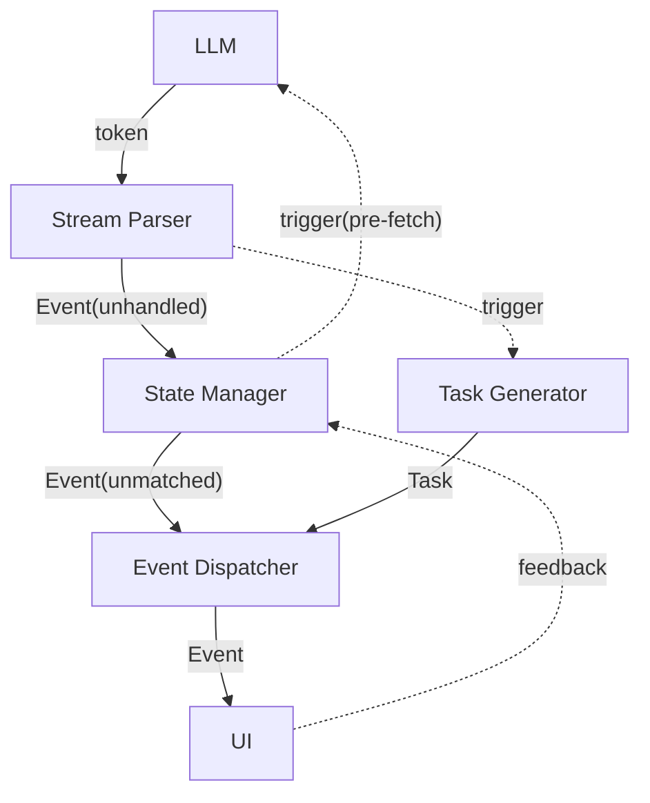

# Phase 2: 图像生成模式

本文为设计草稿，文档中的所有内容：命名、设计等均未确定，可能修改。本文档确认没有问题后才开始写正式设计文档。

## 目标

- 静态角色立绘 + 静态背景图片
- 为保持可拓展性：程序设计尽量兼容任意类型的“媒体数据”（特效、角色语音等），本文主要以上述两类图像数据为例
- 图像模式与文本模式不走同一个 UI 叙事界面，文本模式不丢弃
- 展示模式为传统视觉小说游戏模式（Galgame、《明日方舟》等）

## 核心模式

### 素材数据库

**整体架构**
- 素材数据库分为游戏库与全局库
- 库中包含若干基本的媒体数据类型（角色立绘、背景图像，可拓展）
- 数据库不直接存储素材文件，而是存储元数据并管理素材文件路径

**角色立绘**：
- 每个角色立绘图像类包含：(ID) + name + 描述 + 图片路径 + **使用计数**
- 保持可分类性，类似于 variables 的命名空间，为“小明.微笑”这种形式奠定基础

**背景图像**：
- 与“角色立绘”要求基本一致，但两者属于不同内容类型，具体成员完全可以不一样，图像格式也大概率不同

**游戏库**
- 作用域为一局游戏（节点无关），与游戏存档同级
- 游戏库为全局库的子集，引用全局库的图像并添加其“引用计数”，还可以设置不同的名称
- 每次新“生成”的素材都需要先添加到全局库，游戏库再直接引用
- 游戏存档被删除时，不再维护游戏库，并对应减少其“引用计数”
- 实现上可以是一张分类的索引表（额外记录名称），指向全局库中的具体内容

**全局库**：
- 作用域为 Storyloom 程序
- 主要作用是维护程序全部的素材内容：增删管理、计数管理、按引用计数排序/截取、错误处理等
- 为了防止过度膨胀，需要有清理机制，当总量过多时清理引用计数少的素材
- 提供 UI 管理渠道，当删除引用计数非 0 的素材时给出警告

### 程序匹配 & LLM 选择 & AI 生成（后文统称“制作”）

- 根据图像需求的类型、名称、描述等制作图像，先后经历：程序匹配 -> LLM 选择 -> AI 生成
- 程序匹配：当存在游戏库时，程序直接执行名称比较，从游戏库中寻找能够直接匹配的素材，跳过 API 请求
- LLM 选择：直接匹配失败时，LLM 进行极速主观判定，基于名称和描述，从游戏库和图像库（部分）中选择合适素材；或判定为需要生成
- AI 生成：LLM 判定需要生成时，调用图像生成 AI ，根据需求和关联图像，完成图像生成任务
- 图像生成 AI 调用失败或不可用时，强制回退至选择模式

## AI 与提示词

### AI 定位与分类

**A.共创聊天 LLM**：
- 行为与之前一致，与用户自由交流，提供构建素材

**B.故事设定、大纲生成 LLM**：
- 行为与之前一致，生成内容基本不变

**C.游戏素材预构建 AI**（新增）：
- 基于生成设定中的“地点”“角色”，**制作**游戏的初始素材，填充游戏库（此时为空无法程序直接匹配）
- 可能执行“选择”：复用全局库，也可能“生成”：同时填充游戏库和全局库
- 不要求一一对应，可以制作更多，例如地点为“学校”，可以制作“学校”、“学校.教室”、“学校.操场”等，但必须包含“学校”

**D.叙事阶段 LLM**（修改）：
- 作为游戏故事的“导演”，依然只负责纯文本 XML 生成
- 新素材声明：
  - 标签：`<declare kind="CHAR/SCENE" name="...">..description...</declare>`
  - 作用为声明新素材（不在 locations, characters 中），提前触发图像制作任务，不会产生内容上的实际影响
  - **仅解析不传输事件**，解析出 `DECLARE` 事件后仅触发制作任务，不传给后续处理流程和 UI
- 场景/地点:
  - 必须展示，只能切换不能置空，数据状态部分说明上轮结尾的场景，方便 LLM 承接
  - 变化频率较低，通过 `<set>` 标签切换，类似于 `set` 对于 `BRANCH` 的切换，例如：`<set var="SCENE" val="教室"/>`
  - 产生 `SCENE` 事件，**需要**传输到 UI ，可以和 `SEG` 一样占用专门的等待时间
- 角色立绘：
  - 变化频率极高，作为 `<seg>` 的成员字段，例如 `<seg char="小明">小明: 老师，我来交作业。</seg>`
  - 若缺省：：`<seg>......</seg>`，表示此处不需要展示角色立绘
  - 同样产生 `SEG` 事件，其内容和处理方式需要更新
- `SCENE` 和带 `char` 的 `SEG` 需要与对应的制作任务结果进行匹配，再分发

**E.媒体数据制作 AI**（新增）：

- 触发“制作”任务，若程序精准匹配名称失败，发起 API 请求
- LLM 选择
    - （构想）LLM 快速选择也许不需要“思考”，可以尝试通过在程序端针对模型添加特定 extra_body 关闭“思考”，加快响应速度
    - LLM 接收素材的名称和描述，游戏库和图形库（部分）的名称和描述，返回判断结果（选择的图像 / 需要生成）
- AI 图像生成
    - 调用图像生成 API ，获得/下载图像结果，并加入到游戏和全局库中
    - 返回：图像的唯一性信息，如路径，ID 等

**F.冒险日志生成 LLM**
- 行为与之前一致

### 提示词

**游戏素材预构建 Prompt**
- 角色立绘、场景图片等用不同的提示词
- 对于每一个角色/场景，建议并发执行构建流程，减少生成用时
- 传入角色/场景的名称、描述，以及完整的全局库（此时游戏库为空），调用 LLM 快速判断
- 告知LLM 无需关注“名称”匹配度，防止名称不合适但描述契合的图像被丢弃，图像选择后在游戏库中重新命名
- 若判断结果为需要“生成”，传入详细描述和“范例图像”，调用图像生成 API 进行生成
- 说明可以生成多个不同方向的图片，大约1-3个，例如学校：学校 / 学校.教室 / 学校.操场

**叙事阶段提示词 Prompt**
- 不修改原有Prompt，在原有基础上独立新建
  - 简单添加图像模式说明，让其理解自己的任务与设置各种标签的原因
  - 添加 `<declare>`/ `<set var="SCENE" ...>` / `<seg char="xxx" ...>` 标签格式说明和要求
  - 彻底更新或重构示例，保持示例 1 侧重交互自由度，示例 2 侧重剧情大纲关联性
  - 数据状态部分添加上轮末尾场景信息

**媒体数据实时制作 Prompt**
- API 调用流程在程序直接匹配失败后进入，角色立绘、场景图片等用不同的提示词
- 传入角色/场景的名称、描述，以及游戏库、全局库（按频率截取20个左右）图像的名称、描述，调用 LLM （无“思考”）快速判断
- 同样要求全局库不关注“名称”匹配度
- 若判断结果为需要“生成”，传入详细描述和最近 n 张同类型图像（引擎侧存储，不足时传游戏库内容），调用 API 进行生成
- 缩短流程用时为核心目标，一次仅能选择或生成一张图像

## 流程解析

### 共创流程

1. 构建故事设定和大纲（不变）
2. 执行游戏素材“制作”流程
3. 初始化游戏素材库，并加入全局库

### 叙事流程



### 关键说明

**数据流**
- 实线：持续传输和消费的数据流，通常输入和消费不同步、依赖缓冲队列，需判断使用同步、异步还是多线程模式
- 虚线：单次触发、直接传输的数据或流程

**时序模型**：
- LLM 生成 -> 引擎处理/素材制作 -> UI 展示
- 相对项目现有状态的变更：
    - 将解析与数据处理在时序上拆分(`Parser + StateMng`)
        - 实质：将内容源头从产生 `token` 转换为直接产生程序可处理的 `Event`
        - 效果：在生成的第一时间就可以判断类型并发起制作任务，是一种“预处理”
    - 添加：任务生成和素材匹配管线 `TaskGen + EventDis`

**Stream Parser**
- 对输入 token 进行流式解析，解析出其对应的 `Event`（需要存储起始**行号**，作为匹配标识）
- 时序与 LLM 生成基本一致，接收、消费从不主动阻塞
- 若类型为 `DECLARE / SCENE / SEG(has_char)` ，需要同步触发 TaskGen 构造 `Task`
- `DECLARE` 不传输给 StateMng ，这个事件仅和 TaskGen 相关

**State Manager**
- 数据处理和流程管理
    - `SET` 应用、`CHECKPOINT` 应用等
    - `CHOICE_END` 等待 UI 反馈，**阻塞**消费
    - `BRANCH` 根据 `current_branch` 执行过滤
    - `BRIDGE` 切换模式，极速解析至 `STORY_END` ，触发 `pre-fetch` 桥接流程

**Task Generator**
- 构造制作图像的并发任务 `Task` ，大致包括：
    - `line`: 对应事件的起始行号，`DECLARE` 触发的任务设为特殊值 `0`
    - `type`: character/scene，或设计为 `Task` 的两个子类
    - `process`: 执行的任务（程序匹配 -> LLM 判断 -> 图像 AI 生成，返回图像，添加游戏库）
    - `completed`: 完成标记
    - `result`: 返回的图像结果（ID或路径）
- `Task` 相对独立、互不干扰，完成顺序不关注，但发起和消费的顺序需保持一致
- `DECLARE` 触发的特殊 `Task` 不匹配事件，但不能简单过滤——必须等待其完成才能消费后续事件
- 若 EventDis 发起消费请求，不管队首 `Task` 是否完成，都直接出队，由匹配器执行过滤和等待

**Event Dispatcher**
- 将 `Event` 与 `Task` 进行**匹配**
- 流程伪代码：
```
consume(Event)
while Task.line < Event.line:   # 推进 cursor，清孤 Task
    if Task.line == 0 : wait    # DECLARE Task 等待完成
    consume(Task)
if Task.line == Event.line:     # 对齐了 → 匹配
    wait + match
# Task.line > Event.line 或队列空 → 无匹配需求
send(Event)
```

## 实现方案

### 重构解析/管理/分发流程（仍属于 Phase1）

- 重构 Event 类：需要额外包含起始**行号**
- 构造两个处理模块：`StreamParser`(基于 `StreamingXmlParser`) 和 `StateManager`
- 构造事件分发器 `EventDispatcher` ，仅负责事件的分发
- 可能：UI 事件解析兼容

验证：重构后依然能够完整跑通 Phase1 流程，发布 1.x.x 系列最后版本

### 图像生成与模式区分（进入 Phase2）

- 规划专用的媒体数据素材存储目录结构
- 参考 `api_client` ，搭建基本的图像 API 调用模块
- `user_config` 添加游戏模式（text/graph）、图像 API 配置等，UI、测试等进行适配
- 在 `GameSession` 初始化时就进行模式区分，走不同的管线，复用相同的 Parser, StateMng, EventDis

验证：初步实现图像“生成”功能，区分游戏模式，纯文本模式完整

### 构建素材数据库管理架构

- 设计媒体数据类，目前包括：角色立绘、场景图像
- 搭建全局与游戏素材库：实现引用管理、排序、展示（截取）、自动清理、错误处理等基础设施
- 提供 UI 用户管理渠道

验证：通过测试代码和图像（人工添加）验证数据库基础功能完整性

### 添加角色和场景元素

- 新建图像模式专用的叙事阶段 Prompt ，添加 `declare` 标签, 重构 `set` , `seg` 标签
- 新建 `DECLARE`, `SCENE` 事件, 重构 `SEG` 事件，并支持解析
- Parser 暂时不触发任务构建
- 保持对文本模式的兼容性，两模式在核心管线上只有 Prompt 的区别

验证：测试新提示词， LLM 返回结果可被正确解析

### UI 图像模式：兼容新类型&设计新界面

- 基于原有设计，新增专用图像模式游玩界面
- 共创阶段新增“素材初始化”过渡界面，暂时固定时长
- 设计全新的叙事阶段界面
- 文本模式保持稳定和兼容

验证：通过测试脚本的模拟事件输入，能够达到视觉小说游戏的演出效果

### 搭建任务构建和匹配管线

- 设计 `Task` 类，`process` 用固定时长并发任务临时占位，`result` 统一赋值
- 设计 `Task Generator` 模块，实现 `Task` 构建功能
- Parser 添加图像类事件检测和任务构建触发
- EventDis 基于行号比较逻辑，添加图像匹配功能
- 保证流程对于纯文本模式兼容（管线不包含 Task Generator 和 EventDis）

验证：图像模式能够正常跑通，所有图像为非生成式的统一临时图像

### 共创阶段图像“制作”流程

- 验证 LLM 无“思考”模式可行性，实现无“思考”（参数控制）的 LLM “选择”流程
- 设计游戏素材生成 Prompt(区分类型，多图生成)，实现基于图像生成 AI 的“生成”流程
- 基于故事设定的“地点”和“角色”数据，搭建共创阶段图像“制作”的并发架构
- 素材库，UI 适配

验证：图像模式的共创阶段完整实现，本地全局库得到填充

### 叙事阶段图像“制作”流程

- 参照共创阶段，实现无“思考”（参数控制）的 LLM “选择”流程
- 参照共创阶段，设计游戏素材生成 Prompt(单图)，实现“生成”流程
- 搭建完整的“制作”流程架构，实现程序“直接匹配”机制
- 正式填充 Task ，使其功能完整实现
- 素材库，UI 适配

验证：图像模式能够完整跑通全流程

### 测试与优化

验证：Phase2 构想完全落地

