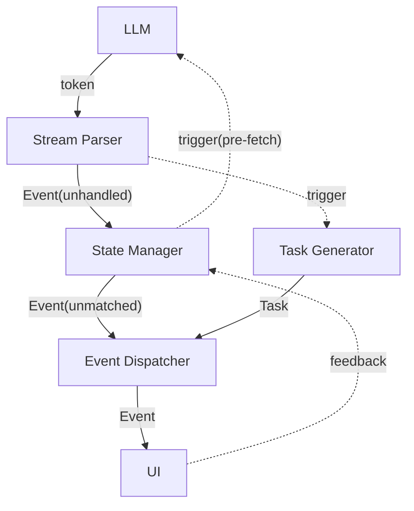

# Phase 2: 图像生成模式

本文为设计草稿，文档中的所有内容：命名、设计等均未确定，可能修改。本文档确认没有问题后才开始写正式设计文档。

## 目标

- 静态角色立绘 + 静态背景图片
- 为保持可拓展性：程序设计尽量兼容任意类型的“媒体数据”，本文主要以上述两类图像数据为例
- 图像模式与文本模式不走同一个 UI 叙事界面，文本模式不丢弃
- 展示模式为传统视觉小说游戏模式（Galgame、《明日方舟》等）

## 核心模式

### 媒体数据库

- 当前媒体数据主要形式为图像，包括“背景图片”，“角色立绘”的核心两大类，未来可拓展，这是两个完全不同的数据类
- 所有媒体数据具体的文件存储结构不重要，重要的是路径索引被记录

**角色立绘**：
- 每个角色立绘图像类包含：ID + name + 描述 + 图片路径 + 使用计数，仅作为建议，可修改
- 保持可分类性，类似于 variables 的命名空间，为以后拓展“小明.微笑”这种形式奠定基础

**背景图像**：
- 与“角色立绘”要求基本一致，但两者属于不同内容类型，具体成员完全可以不一样，图像格式也大概率不同

**全局库和游戏库**：
- 媒体数据库需要分为游戏库与全局库，游戏库作用域为一局游戏，全局库作用域为 Storyloom 程序
- 库中都包含若干基本的媒体数据类型（角色立绘、背景图像等）
- 游戏库为全局库的子集，可以直接引用全局的数据；而每次游戏库新“生成”的媒体数据都需要加入全局库
- 相同媒体数据在游戏库与全局库可能有不同“名称”——不影响，重要的是 ID 或者路径唯一
- 为了保证全局库不过度膨胀，需要有清理机制，需要内部记录使用次数，当总量过多时清理使用次数少的媒体数据
- 存档时需要存储当前的游戏库状态，如果读档时数据破坏，交给专门的错误处理机制

### 选择 & 生成（两者后文统称“制作”）

- AI 根据媒体数据的基本类型、名称、描述等，基于现有的库（游戏库优先，全局次之）自行决定制作方式（仅根据名称、描述进行匹配）
- 如果名称等信息与现有库内容完全匹配，也可通过程序直接“选择”，跳过 API 请求
- 选择：AI 选择一个已经存在的媒体数据类，返回ID或路径等唯一性信息
- 生成：AI 自行生成图像，后台执行，生成完毕后添加到游戏库和全局库，返回这个新增图像的信息
- 当没有配置图像生成 API 时，强制走选择模式

## AI 与提示词

### AI 定位与分类

**A.共创聊天 LLM**：
- 行为与之前一致，与用户自由交流，提供构建素材

**B.故事设定、大纲生成 LLM**：
- 行为与之前一致，生成内容基本不变

**C.游戏素材预构建 AI**（新增）：
- 基于生成设定中的“地点”“角色”，**制作**游戏的初始媒体数据，直接加入库中
- 不要求一一对应，可以制作更多，例如地点为“学校”，可以制作“学校”、“学校.教室”、“学校.操场”等背景图像
- 完全支持“选择”模式，即直接把全局库的数据放入到本局的游戏库中，类似于流程 `E`

**D.叙事阶段 LLM**（修改）：
- 作为游戏故事的“导演”，依然只负责纯文本 XML 生成
- 在原有的基础上添加一些标签元素：场景/地点标签、角色立绘标签，“导演”负责进行编排
- LLM 自行判断是否需要添加“描述”（环境/外貌），例如设定中的地点就不需要，新出现的角色就需要
- 场景/地点:
  - 必须展示，只能切换不能置空，“Continue from”或其他部分说明上轮此处的场景，方便 LLM 承接
  - 变化频率较低，完全可以新设置一个元素 `<scene name="xxx">...description...</scene>`
  - 若不需要描述，可以自闭合 `<scene name="xxx"/>` 或者就不写描述
  - 此标签负责场景切换，UI 侧处理时，需要和 `<seg>` 一样占用专门的等待时间
- 角色立绘：
  - 变化频率极高，若不需要描述，建议作为 `<seg>` 的子元素，例如 `<seg character="xxx">........</seg>`
  - 若需要描述，添加标签：`<character name="xxx">...description...</character>`，然后再正常使用，此标签不切换立绘
  - 立绘也可以不展示，此时保留原样：`<seg>......</seg>`，表示此处不需要展示角色立绘
- 当遇到 scene、character 等标签时，触发“制作”任务（告知 AI 名称、描述），获得图像结果，并最终与 `SCENE`、`SEG`、`CHARACTER` 事件进行对应。`CHARACTER` 只负责提前制作图像并直接入库，不需要向 UI 发送

**E.媒体数据实时制作 AI**（新增）：

- 当遇到 scene、character 等元素时触发“制作”任务，如果能够精准匹配名称，由程序直接“选择”，跳过 API 请求
- 本质上包括两次 API 的调用：1. LLM 快速判断 2. 可能触发的图像生成 AI 调用
- LLM 快速调用
    - （构想）LLM 快速判断也许不需要“思考”，可以尝试通过在程序端针对模型添加特定 extra_body 关闭“思考”，加快响应速度
    - LLM 接收素材的名称和描述，图像库数据的名称和描述，返回判断结果（“选择”-返回其图像唯一性信息）
- 图像生成 AI 调用
    - 若 LLM 返回“生成”，由程序负责调用图像生成 API ，获得/下载图像结果，并加入到图像库中
    - 返回：图像的唯一性信息，如路径，ID 等

**F.冒险日志生成 LLM**
- 行为与之前一致

### 提示词

**游戏素材预构建 Prompt**
- 角色立绘、场景图片等用不同的提示词
- 对于每一个角色/场景，建议并发执行构建流程，减少生成用时
- 传入角色/场景的名称、描述，以及完整的全局库（此时游戏库为空），调用 LLM 快速判断
- 这个阶段传入全局库信息时可以不说明“名称”，防止仅仅因为名称不同被 LLM 丢弃
- 若判断结果为需要“生成”，传入详细描述和“范例图像”，调用图像生成 API 进行生成
- 说明同一要求可以生成多个不同方向的图片，大约1-3个，同名内容必须包含，例如学校：学校/学校.教室/学校.操场

**叙事阶段提示词 Prompt**
- 主要修改在前缀部分
  - 简单添加图像模式说明，让其理解自己的任务与设置各种标签的原因
  - 添加 `<scene>`/ `<character>` / `<seg character>` 标签格式说明和要求
  - 彻底更新或重构示例，保持示例 1 侧重交互自由度，示例 2 侧重剧情大纲关联性。

**媒体数据实时制作 Prompt**
- 每次“制作”任务触发时，自身维持一个任务流程，API 调用流程在程序直接匹配失败后进入
- 角色立绘、场景图片等用不同的提示词
- 传入角色/场景的名称、描述，以及游戏库、全局库（按频率截取20个左右）图像的名称、描述，调用 LLM （无“思考”）快速判断
- 若判断结果为需要“生成”，传入详细描述和近三张同类型图像（引擎侧存储，不足时传游戏库内容），调用 API 进行生成
- 保证流程用时短为核心，一次仅能选择或生成一张图像

## 流程解析

### 共创流程

1. 构建故事设定和大纲（不变）
2. 执行游戏素材“制作”流程
3. 初始化游戏素材库，并加入全局库

### 叙事流程



### 关键说明

**数据流**
- 实线：持续传输和消费的数据流，通常输入和消费不同步、依赖缓冲队列，需判断使用同步、异步还是多线程模式
- 虚线：单次触发、直接传输的数据或流程

**时序模型**：
- LLM 生成 -> 引擎处理/媒体数据制作 -> UI 展示
- 相对项目现有状态的变更：
    - 将解析与数据处理在时序上拆分(`Parser + StateMng`)
        - 实质：将内容源头从产生 `token` 转换为直接产生程序可处理的 `Event`
        - 效果：在生成的第一时间就可以判断类型并发起制作任务，是一种“预处理”
    - 添加：任务生成和媒体数据匹配管线 `TaskGen + EventDis`

**Stream Parser**
- 对输入 token 进行流式解析，解析出其对应的 `Event`（需要存储起始**行号**，作为匹配标识）
- 时序与 LLM 生成基本一致，接收、消费从不主动阻塞
- 若类型为 `SCENE / CHARACTER / SEG(has_character)` ，需要同步触发 TaskGen 构造 `Task`

**State Manager**
- 数据处理和流程管理
    - `SET` 应用、`CHECKPOINT` 应用等
    - `CHOICE_END` 等待 UI 反馈，**阻塞**消费
    - `BRANCH` 根据 `current_branch` 执行过滤
    - `BRIDGE` 切换模式，极速解析至 `STORY_END` ，触发 `pre-fetch` 桥接流程

**Task Generator**
- 构造制作图像的并发任务 `Task` ，大致包括：
    - `line`: 对应事件的起始行号
    - `type`: character/scene，或设计为 `Task` 的两个子类
    - `process`: 执行的任务（程序匹配 -> LLM 判断 -> 图像 AI 生成）
    - `completed`: 完成标记
    - `result`: 返回的图像结果（ID或路径）
- `Task` 相对独立、互不干扰，完成顺序不关注，但发起和消费的顺序需保持一致
- 若 EventDis 发起消费请求，不管队首 `Task` 是否完成，都直接出队，由匹配器执行过滤和等待

**Event Dispatcher**
- 将 `Event` 与 `Task` 进行**匹配**
- 流程伪代码：
```
consume(Event)
while Task.line < Event.line:   # 推进 cursor，清孤 Task
    consume(Task)
if Task.line == Event.line:     # 对齐了 → 匹配
    wait + match
# Task.line > Event.line 或队列空 → 无匹配需求
send(Event)
```

## 实现方案

### 重构解析/管理/分发流程（仍属于 Phase1）

- 重构 Event 类：需要额外包含起始**行号**
- 构造两个处理模块：`StreamParser`(基于 `StreamingXmlParser`) 和 `StateManager`
- 构造事件分发器 `EventDispatcher` ，仅负责事件的分发

验证：重构后依然能够完整跑通 Phase1 流程，发布 1.x.x 系列最后版本

### 模式区分与图像生成（进入 Phase2）

- 规划专用的媒体数据存储目录结构
- 参考 `api_client` ，搭建基本的图像 API 调用模块
- `user_config` 添加游戏模式（text/graph）、图像 API 配置等，UI、测试等进行适配
- 在 `GameSession` 初始化时就进行模式区分，走不同的管线，复用相同的 Parser, StateMng, EventDis

验证：初步实现图像“生成”功能，区分游戏模式，纯文本模式完整

### 构建媒体数据库管理架构

- 数据库不直接存储图像文件，而是存储元数据并管理图像文件路径
- 设计媒体数据类，目前包括：角色立绘、场景图像
- 搭建全局与游戏媒体数据库：实现频率排序、完整展示（有无name）、截取展示、自动清理、错误处理等基础设施

验证：通过测试代码和图像（人工添加）验证数据库基础功能完整性

### 添加角色和场景元素

- 新建图像模式专用的叙事阶段 Prompt ，添加 `scene`, `character` 相关元素
- 新建 `SCENE`, `CHARACTER`, `SEG_CHARACTER` 等事件，并支持解析
- 图像模式 Parser 暂时不触发任务构建

验证：测试新提示词， LLM 返回结果可被正确解析

### UI 图像模式：兼容新类型&设计新界面

- 共创阶段新增“素材初始化”过渡界面，暂时固定时长
- 设计全新的叙事阶段界面
- 兼容新增事件类型的处理

验证：通过测试脚本的模拟事件输入，能够达到视觉小说游戏的演出效果

### 搭建任务构建和匹配管线

- 设计 `Task` 类，`process` 用固定时长并发任务临时占位，`result` 统一赋值
- 设计 `Task Generator` 模块，实现 `Task` 构建功能
- Parser 添加图像类事件检测和任务构建触发
- EventDis 基于行号比较逻辑，添加图像匹配功能
- 保证流程对于无图像类元素的纯文本模式兼容

验证：图像模式能够正常跑通，所有图像为非生成式的统一临时图像

### 共创阶段图像“制作”流程

- 验证 LLM 无“思考”模式可行性，实现无“思考”（参数控制）的 LLM “选择”流程
- 设计游戏素材生成 Prompt(区分类型，多图生成)，实现基于图像生成 AI 的“生成”流程
- 基于“地点”和“角色”数据，搭建多图像“制作”的并发架构
- UI 适配

验证：图像模式的共创阶段完整实现，本地全局库得到填充

### 叙事阶段图像“制作”流程

- 参照共创阶段，实现无“思考”（参数控制）的 LLM “选择”流程
- 参照共创阶段，设计游戏素材生成 Prompt(单图)，实现“生成”流程
- 搭建完整的“制作”流程架构，实现程序“直接匹配”机制
- 正式填充 Task ，使其功能完整实现

验证：图像模式能够完整跑通全流程

### 测试与优化

验证：Phase2 构想完全落地

