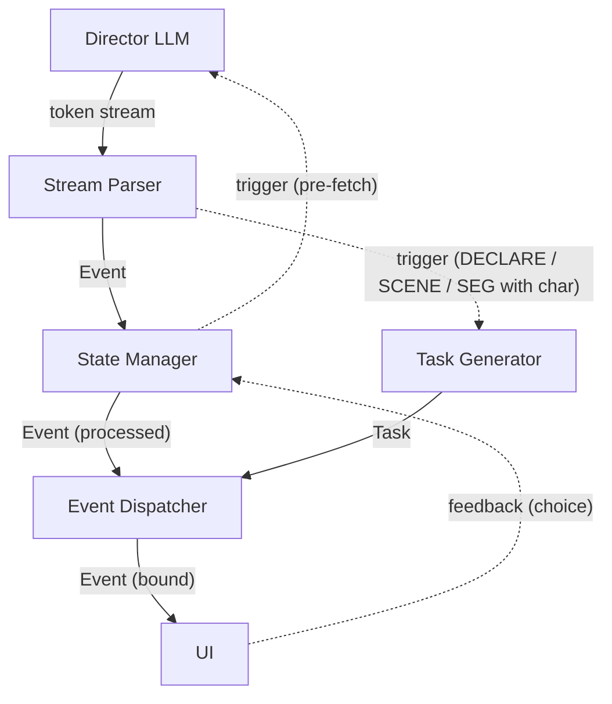

# Phase 2: 图像模式 — 程序设计规范

> **定位**：图像模式的完整程序设计——数据模型、管线架构、流程定义与分阶段实现方案。
> **配套**：[`exec-flow.md`](./exec-flow.md)、[`block-spec.md`](./block-spec.md)、[`data-model.md`](./data-model.md)、[`prompt-design.md`](./prompt-design.md)、[`theory/asset-generation.md`](../theory/asset-generation.md)

---

## §1 概述与设计目标

图像模式在 Phase 1 纯文本基础上增加静态角色立绘与背景图片，呈现视觉小说演出效果。两模式共享核心引擎（GameState、存档、桥接、上下文管理），在管线组件和 Prompt 层面分道：

| 层面 | 文本模式 | 图像模式 |
|------|---------|---------|
| Prompt | Phase 1 叙事 Prompt | 图像模式叙事 Prompt（新增元素） |
| 管线 | StreamParser → StateManager → EventDispatcher | 同上 + **TaskGenerator** |
| AI 角色 | 共创 + 导演 + 冒险日志 LLM | 上述全部 + 预构建 AI + 匹配 LLM + 生成 AI |

**文档原则**：每条设计事实只在一处权威定义，其余位置引用而非重复。修改时只改一处。

**设计原则**：
- **管线复用**：图像模式与文本模式共享核心管线，差别仅在于是否挂载 TaskGenerator
- **素材管线并行**：素材匹配/生成异步执行，不阻塞文本管线流转
- **事件-素材绑定**：EventDispatcher 是唯一绑定点——UI 收到的素材事件均已完成绑定
- **占位优先**：DECLARE 触发时立即在名册中创建占位条目，素材文件异步填充
- **阻塞不影响消费**：管线阻塞的是事件分发，UI 由自身缓冲区驱动

**与 Phase 1 的关系**：
- 不变：游戏循环、GameState、存档系统、结局检测、桥接机制、上下文管理、共创 Step 1-3、冒险日志
- 变化：`StreamingXmlParser` 拆解重构为 StreamParser + StateManager + EventDispatcher；新增素材管线与 AI 角色；叙事 Prompt 扩展；新增 `<declare>`、修改 `<set>`/`<seg>` 语义

---

## §2 素材数据模型

### 2.1 三层抽象

| 层 | 形式 | 消费者 |
|------|------|--------|
| 故事设定 | `story_config.locations` / `characters` | 导演 LLM（上下文） |
| 导演调度 | `<set var="SCENE">` / `<seg char="...">` | 程序（素材匹配） |
| 素材存储 | `media/` + `_asset_lib.json` | 引擎（文件路径映射） |

示例："学校" → 导演调度 "学校" / "学校.教室" → 背景图片 + 背景音乐。类型可扩展至特效、语音等。

映射链：导演 LLM 从 locations/characters 中选择或通过 `<declare>` 声明 → 程序通过名册中 `local_name` 匹配 → 定位到素材库中的实际文件。导演 LLM 只使用 `local_name`，不感知 `asset_id` 和文件路径。

### 2.2 素材库（AssetLibrary）

全局素材注册表，一个实例一份。存储于 `media/_asset_lib.json`。

```
Asset:
  asset_type: AssetType    # CHAR_PORTRAIT | BACKGROUND | ...
  id: str                  # 唯一标识，对应文件 media/{type}/{id}.{ext}
  name: str                # 生成时的描述性名称
  description: str         # 详细描述
  use_count: int           # 被引用计数

AssetType.default_extension: 每种类型一种默认扩展名（如 .png）
```

操作：`add` / `remove`（use_count==0 才允许）/ `increase_usage` / `decrease_usage` / `get_sorted_by_usage`（按计数降序取前 N）/ `clean`（手动触发，保留机制）。

### 2.3 游戏素材名册（GameAssetRoster）

单个游戏的素材映射表。存储于 `saves/{game_id}/_asset_roster.json`。

```
AssetItem:
  local_name: str             # LLM 使用的名称，同类型下唯一
  local_description: str      # 本地描述
  target: str | None          # 指向 AssetLibrary 中的 Asset.id

GameAssetRoster:
  _items: Dict[AssetType, Dict[str, AssetItem]]
```

操作：`add`（target 非空时 increase_usage）/ `set_target`（increase_usage）/ `remove`（decrease_usage）/ `lookup`（精确字符串比较）/ `clear`（所有条目的 decrease_usage）。

`local_name` 可以与 `Asset.name` 不同——LLM 可在名册中重新命名。程序匹配使用精确字符串比较。`target = None` 表示素材尚未生成完毕，UI 使用默认占位图。

---

## §3 管线架构

### 3.1 组件拓扑



> Task Pool 是独立线程池，不在数据流路径上——它从 Task Queue 取出 Task 执行 `process`，完成后原地标记 `completed=True`。EventDispatcher 从同一 Task Queue 读取并按 `completed` 标记决定等待或消费。

实线（`──`）：流式数据——跨线程经队列，同线程经 generator yield
虚线（`-.`）：单次触发信号或控制反馈

### 3.2 组件职责

| 组件 | 职责 |
|------|------|
| **StreamParser** | 逐行解析 token 流产出 Event。识别图像标签时触发 TaskGenerator。DECLARE 不传递给 StateManager |
| **StateManager** | SET/CHECKPOINT/BRANCH/BRIDGE 处理、CHOICE_END 阻塞。SCENE 事件在此更新 `current_scene` 状态 |
| **TaskGenerator** | 构造 Task，先执行 O(1) 程序匹配。成功则 `completed=True`；失败则设置 `process` 提交 Task Pool |
| **Task Pool** | 线程池，并发执行 Task.process（LLM 匹配 / AI 生成） |
| **EventDispatcher** | 按行号对齐 Event 与 Task，等待未完成 Task 后绑定，推入 UI Event Queue |

### 3.3 线程与队列

```
Thread 1: Server Main  — HTTP + SSE 推送
Thread 2: Event Pipe   — StreamParser → StateManager → EventDispatcher（generator yield，同线程）
Thread 3: API Reader   — LLM token 流式读取（阻塞）
Thread 4: Task Pool    — ThreadPoolExecutor
```

| 队列 | 生产者 | 消费者 |
|------|--------|--------|
| Token Queue | API Reader | StreamParser |
| Task Queue | TaskGenerator | EventDispatcher |
| UI Event Queue | EventDispatcher | Server Main |

Task Queue 中的 Task 从创建之初即入队（`completed=False`），Task Pool 完成后标记 `completed=True`。EventDispatcher 通过 `completed` 标记决定等待或消费。

### 3.4 阻塞点

| 阻塞点 | 原因 | UI 影响 |
|--------|------|---------|
| CHOICE_END | 等待玩家选择 | 否——UI 展示选项界面 |
| Task 未完成（line=0 过滤） | 等待 DECLARE 生成完毕 | 否——UI 消费缓冲区已有事件 |
| Task 未完成（line==Event.line） | 等待匹配完成 | 否——UI 消费该事件之前的其他事件 |

管线阻塞的是事件分发，不是 UI 消费。

### 3.5 时序模型

```
LLM 生成（token 产出）
    ≥
程序解析（Parser + StateManager + TaskGenerator）
    ≥
事件分发（EventDispatcher → 绑定 → UI Queue）
    ≥
UI 消费（用户阅读 / 自动推进）
```

拆分的实质：将内容源头从产生 token 转换为直接产生程序可处理的 Event，在生成的第一时间即可判断类型并发起制作任务（"预处理"），素材生成与文本消费重叠。

与 Phase 1 的关键差异：解析与处理拆分——Parser 产出事件后，StateManager 处理状态逻辑，TaskGenerator 并行发起素材任务，EventDispatcher 在 UI 之前完成素材绑定。

---

## §4 事件与任务系统

### 4.1 事件类型

```
Event:
  type: EventType
  line: int           # 起始行号（NNN| 前缀）
  payload: dict
```

| 事件 | 来源 | →StateManager | →触发 TaskGen |
|------|------|:---:|:---:|
| `SEG` | `<seg>` | ✓ | ✓（有 `char` 属性时触发 MATCH） |
| `SCENE` | `<set var="SCENE" val="...">` | ✓ | ✓（MATCH） |
| `DECLARE` | `<declare>` | | ✓（GENERATE） |
| `SET`、`CHOICE`、`CHECKPOINT`、`BRIDGE` 等 | 同 Phase 1 | ✓ | |

- **SEG**：重构以支持可选 `char` 属性——`<seg char="...">` 仍产生 `SEG` 事件，payload 中增加 `char` 字段。`char=""` 或缺省时无此字段，不触发素材匹配
- **SCENE**：`<set var="SCENE">` 不解析为 SET，解析为独立 SCENE 事件。StateManager 维护 `current_scene` 状态，在下一轮 Prompt 状态部分携带
- **DECLARE**：Parser 解析后仅触发 TaskGenerator，不进入事件流

### 4.2 任务模型

```
Task:
  task_type: MATCH | GENERATE
  line: int              # 对应 Event 的起始行号
  asset_type: AssetType
  process: Callable|None # None 表示已同步完成
  completed: bool
  result: str|None       # MATCH → local_name；GENERATE → 不绑定

line 取值：
  SCENE / SEG 触发 → 事件的 line
  DECLARE 触发         → 0（永远落入过滤分支）
```

**Task 生命周期**：

```
1. 创建 → 2. 同步程序匹配（O(1)）
   ├── 成功 → completed=True, process=None
   └── 失败 → MATCH: process=LLM匹配闭包
              GENERATE: 立即创建占位 AssetItem → process=LLM选择+AI生成闭包
3. process 非 None → 入 Task Queue（completed=False）→ 提交 Task Pool
4. Task Pool 执行 → completed=True
```

### 4.3 EventDispatcher 算法

```
consume_event(event):
    while task_queue 非空 and 队首.line < event.line:
        task = pop()
        if task.line == 0:
            wait(task.completed)   # DECLARE Task：等待完成后丢弃
        # 否则直接丢弃（孤 Task，不与任何事件绑定）

    if task_queue 非空 and 队首.line == event.line:
        task = pop()
        wait(task.completed)       # 等待匹配完成
        asset_id = roster.lookup(task.asset_type, task.result).target
        event.payload["assets"] = {task.asset_type.value: asset_id}

    send_to_ui(event)
```

> Task.result 存储 local_name，EventDispatcher 通过名册将其解析为 asset ID 后再写入 Event。UI 只接收 ID，不感知 local_name。`assets` 字段为 `{AssetType: asset_id}` 字典——当前每个 Event 只绑定一个素材，格式预留未来多素材扩展（如 SCENE 同时绑定背景图 + BGM）。

**line=0 的设计意图**：
- 所有 Event 的 line ≥ 1 → `Task(0).line < Event.line` 恒成立 → DECLARE Task 永远落入过滤分支，不与任何 Event 绑定
- 过滤前 `wait`：确保后续 MATCH Task 匹配到的 AssetItem 有真实 target，而非空占位
- 按 FIFO 顺序消费，不抢跑——Task(0) 在 Parser 到达 DECLARE 时入队，此后的第一个 Event 触发对其的消费与等待

---

## §5 AI 角色与提示词

### 5.1 角色总览

| 角色 | 类型 | 职责 |
|------|------|------|
| **A. 共创聊天 LLM** | 对话 | 不变——与用户自由交流 |
| **B. 故事设定/大纲 LLM** | 生成 | 不变——产出 story_config（含 characters.appearance、locations.description） |
| **C. 素材预构建 AI** | 选择+生成 | **新增**——共创阶段基于 locations/characters 生成初始素材，填充名册 |
| **D. 叙事导演 LLM** | 生成 | **修改**——新增 `<declare>`、`<set var="SCENE">`、`<seg char="...">` |
| **E. 素材匹配 LLM** | 选择 | **新增**——程序匹配失败后从名册中强制选择，无"思考"模式 |
| **F. 素材生成 AI** | 选择+生成 | **新增**——DECLARE 触发，LLM 选择（素材库）→ AI 生成（新素材） |
| **G. 冒险日志 LLM** | 生成 | 不变 |

### 5.2 D. 叙事导演 LLM（修改）

在 Phase 1 基础上独立新建图像模式版本。核心行为不变，新增：
- `<declare kind="CHAR/SCENE" name="...">description</declare>` — 声明新素材
- `<set var="SCENE" val="...">` — 切换场景（只能切换不能置空）
- `<seg char="...">` — 关联角色立绘（缺省 = 无立绘）

约束：SCENE 和 char 的值必须在 locations/characters 或 `<declare>` 中出现过；`<declare>` 靠近使用点声明；状态部分额外携带上轮末尾场景信息。

### 5.3 C. 素材预构建 AI（新增）

共创阶段故事生成后触发。对每个 location/character，LLM 选择（素材库）→ 若 NULL 则 AI 生成。允许 1-3 个变体（如 "学校" / "学校.教室" / "学校.操场"）。按实体并发执行。LLM 选择时不关注名称匹配度——图像可在名册中重新命名。

### 5.4 E. 素材匹配 LLM（新增）

SCENE/SEG 程序匹配失败后触发。输入：目标名称 + 名册条目（local_name + local_description）。输出：一个 local_name（强制选择，必须返回结果）。无"思考"模式——快速选择。不同素材类型使用不同 Prompt。

> 与 F（素材生成 AI）中 LLM 选择的关键区别：匹配是**强制选择**——必须从名册中选出一个条目；选择允许返回 NULL——表示素材库中无合适素材。

### 5.5 F. 素材生成 AI（新增）

DECLARE 触发。两阶段：LLM 选择（名册 + 素材库截取，无"思考"，返回 Asset.id 或 NULL）→ 若 NULL 则 AI 图像生成（一次一张，延迟优先）。完成后通过 `set_target` 填充占位条目。

> LLM 选择包含名册——防止 LLM 在不同轮次对同一实体使用不同名称而无法复用已有素材。需排除当前 DECLARE 自身在名册中的占位条目。匹配策略：名册中名称匹配优先于描述；素材库中描述匹配优先于名称。

### 5.6 提示词要点

所有系统 Prompt 使用英文，素材名称/描述使用故事语言。
- **叙事 Prompt**：新增元素的 Purpose→Attributes→Requirements→Snippet 描述；两个示例加入图像标签并彻底重构（示例 1 侧重交互自由度，示例 2 侧重剧情大纲关联性）；新增约束（SCENE 不置空、declare 靠近使用点等）
- **预构建/匹配/生成 Prompt**：按素材类型区分；LLM 选择阶段使用无"思考"模式；AI 生成阶段需传入参考图像——光有文字描述不足以保证生成质量。传入内容：详细描述 + 最近 N 张同类型图像（引擎侧存储，区分类型，不足时传范例图像）
- 共创聊天、故事生成、冒险日志 Prompt 不变

---

## §6 流程解析

### 6.1 共创流程

```
Step 1-3: 不变（用户输入 → 自由对话 → 故事生成）
    │
    ▼
Step 4: 素材预构建（新增）
    此时游戏素材名册为空。对每个 location / character 并发执行：
      LLM 选择（仅查素材库）→ NULL → AI 生成（1-3 变体，可含参考图像）
    │
    ▼
Step 5: 初始化素材名册（用预构建结果填充）+ GameState → 进入叙事循环
```

### 6.2 叙事轮次流程

```
Round N 开始
  │
  ├─ 1. TTFT 等待：UI 展示上轮 bridge_text
  │
  ├─ 2. 流式解析（StreamParser）：
  │     普通标签 → StateManager
  │     图像标签（SCENE、SEG with char）→ StateManager + 触发 TaskGenerator（MATCH Task）
  │     DECLARE → 仅触发 TaskGenerator（GENERATE Task，line=0，入 Task Queue）
  │     TaskGenerator 同步执行程序匹配（O(1)）
  │
  ├─ 3. StateManager 处理：
  │     SET（SCENE 除外）、CHECKPOINT 路由、BRANCH 过滤
  │     CHOICE_END 阻塞、BRIDGE 模式切换
  │     → 处理后事件传给 EventDispatcher
  │
  ├─ 4. EventDispatcher（按 §4.3 算法）：
  │     消费 Task Queue 直到 Task.line >= Event.line
  │     对齐时等待+绑定 → 推入 UI Event Queue
  │
  └─ 5. </story>：合并格式错误 → 组装下轮 Prompt → 后台 API 调用
```

### 6.3 素材匹配流程（SCENE / SEG with char）

```
事件 → TaskGenerator 构造 MATCH Task
  ├── 程序匹配（O(1)，精确字符串比较）
  │   └── 成功 → completed=True, result=local_name
  └── 失败 → Task Pool：LLM 匹配（无"思考"，强制选择）
       → completed=True, result=local_name
→ EventDispatcher 在对应 line 等待+绑定 → UI
```

### 6.4 素材生成流程（DECLARE）

```
DECLARE → TaskGenerator 构造 GENERATE Task（line=0）
  ├── 程序匹配（名册中是否已有同名条目）
  │   └── 成功 → completed=True（无需操作）
  └── 失败 → 立即创建占位 AssetItem（target=None）
       → Task Pool：LLM 选择（名册 + 素材库截取）
         ├── 返回 Asset.id → set_target
         └── NULL → AI 图像生成 → 加入 AssetLibrary → set_target
→ EventDispatcher：line=0 过滤分支，wait 完成后丢弃
```

---

## §7 实现方案

> 每步独立验证，通过后即确定该维度正确性。步骤间依赖明确，不返工。7.4 ∥ 7.5、7.7 ∥ 7.8 可并行。

### 7.1 重构管线（仍属 Phase 1）

StreamParser + StateManager + EventDispatcher 拆分。Event 增加行号字段。同线程 generator yield 传递。

**验证**：Phase 1 全量测试通过 → **管线拆分正确，无回归**。

### 7.2 素材数据库

Asset、AssetLibrary、GameAssetRoster 完整实现——增删、计数、排序截取、清理。提供 UI 管理渠道。

**验证**：单元测试覆盖所有操作 + 边界条件 → **数据层可独立工作**。

### 7.3 图像 API 与模式配置

参考 `api_client` 搭建图像生成 API 调用模块。`UserConfig` 添加 `game_mode`（text/graph）及图像 API 配置。规划 `media/` 目录结构。`GameSession` 按模式挂载管线。

**验证**：单次图像生成成功 + 文本模式不受影响 → **API 层可独立工作，模式切换正确**。

### 7.4 Task 框架（stub）

实现 Task 类 + TaskGenerator（独立模块，Parser 不感知）+ EventDispatcher 行号对齐与绑定。`process` 用固定时长占位，`result` 统一赋值为临时图像。此阶段 Parser **不**触发 TaskGen——通过手动构造事件序列验证管线。测试用例设计为可复用的集成测试，7.6 用真实事件重放同一套用例。

**验证**：stub 管线跑通，所有"素材"为统一临时图像，文本模式不受影响 → **事件-任务-绑定架构正确**。

### 7.5 XML 元素与 Prompt

新建图像模式叙事 Prompt（含 `<declare>`、`<set var="SCENE">`、`<seg char="...">` 完整说明与示例）。StreamParser 解析新标签，产出对应 Event。Parser 改动最小化——仅增加标签识别，不涉及 TaskGen。文本模式 Prompt 不变。

**验证**：LLM 输出被正确解析为 DECLARE/SCENE/SEG 事件，文本模式无影响 → **LLM 契约正确**。

### 7.6 管线集成

将 Parser 的图像事件与 TaskGenerator 挂接——通过管线协调层在 Event 产出后调用 TaskGenerator（Parser 自身不持有 TaskGen 引用）。文本模式不挂载。

**验证**：stub 管线 + 真实事件流端到端跑通 → **集成正确，封装性保持**。

### 7.7 UI 图像模式

基于已确定的事件格式，设计视觉小说界面（立绘 + 背景 + 文本对话框）。共创阶段新增"素材初始化"过渡界面。文本模式界面保持稳定。

**验证**：真实事件流驱动达到视觉小说演出效果 → **接口正确，UI 与引擎独立**。

### 7.8 AI 集成

分三步，逐步替换 stub：

| 子步骤 | 内容 | 验证 |
|--------|------|------|
| 8a. LLM 匹配 | 实现无"思考"匹配/选择流程，填充 MATCH Task.process | 匹配返回正确 local_name |
| 8b. AI 图像生成 | 实现图像生成 API 调用，填充 GENERATE Task.process | 素材库得到填充，名册 target 正确赋值 |
| 8c. 共创预构建 | 并发架构 + 预构建 Prompt（区分类型，多图生成） | 共创阶段完整，全局素材库填充 |

**验证**：图像模式全流程跑通，真实素材替代临时图像 → **AI 集成正确**。

### 7.9 回归验证

文本模式全量测试 + 图像模式端到端测试。

**验证**：全部通过 → **Phase 2 交付就绪**。

---

## §8 文本模式兼容性

图像模式与文本模式共享 StreamParser、StateManager、EventDispatcher。区别在于管线构建时是否挂载 TaskGenerator。

文本模式下：Parser 正常解析所有标签，TaskGenerator 不存在故触发信号无接收者。若 LLM 误输出图像标签：`<set var="SCENE">` → 普通 SET、`<seg char="...">` → 普通 SEG、`<declare>` → 跳过。

两个模式使用不同的叙事 Prompt 文件。`UserConfig.game_mode` 决定模式和 UI 布局。其余 Prompt（共创、故事生成、冒险日志）不受影响。

---

## §9 存储与文件

```
media/
  char_portrait/{asset_id}.png
  background_img/{asset_id}.png
  _asset_lib.json

saves/{game_id}/
  _init.json
  _asset_roster.json
  {checkpoint}.json
```

**_asset_lib.json**：`{version, items: {AssetType: {asset_id: {name, description, use_count}}}}`

**_asset_roster.json**：`{version, game_id, items: {AssetType: {local_name: {local_description, target}}}}`

存档兼容：`_init.json` 和 checkpoint 存档结构不变。读档时加载 `_asset_roster.json`，不存在则初始化为空。文本模式不创建此文件。

素材清理：`use_count` 追踪引用。手动清理（UI 界面）仅允许 `use_count == 0`。自动清理机制保留。

---

## §10 编者提问

> 以下问题用于验证对设计的理解，是后续 Agent 实现时的重要把控依据。

- **更多的交互（选项等）不能为 TTFT 争取缓冲空间，为什么？**（tip: StateManager 阻塞 & 交互区/缓冲区）
- **更多的交互能为图像生成争取缓冲空间，为什么？**（tip: Task 非阻塞管线）
- **`DECLARE` 为什么应该靠近使用点声明，而非尽量靠前？**（tip: LLM 生成用时 vs 用户消费用时）
- **`DECLARE` 触发生成的 Task，为什么不能等素材生成完毕再添加到素材库和素材名册？**

---

## 附录：术语对照

| 中文 | 英文 | 说明 |
|------|------|------|
| 图像模式 | Graph Mode | Phase 2 新增 |
| 素材库 | AssetLibrary | 全局素材注册表 |
| 素材名册 | GameAssetRoster | 单游戏素材映射表 |
| 预构建 | Pre-build | 共创阶段初始素材生成 |
| 匹配 | Match | 从已有素材中选择 |
| 占位 | Placeholder | target=null 的名册条目 |
| 绑定 | Bind | EventDispatcher 将 Task 结果写入 Event |
